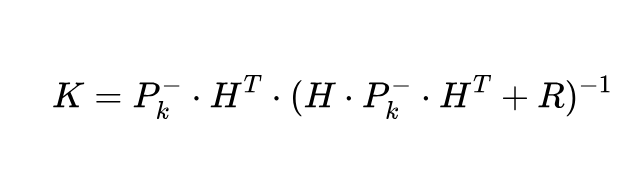
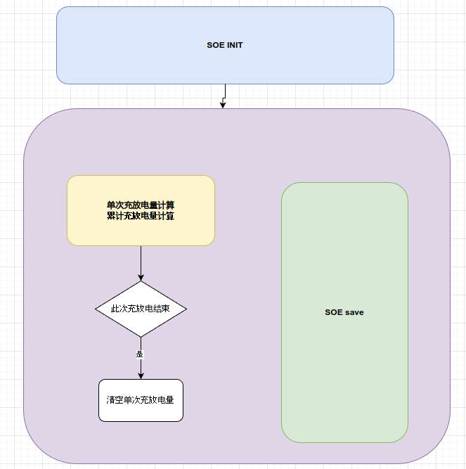

# SOC 模块功能设计
## 目录
- [1. 功能介绍](#1-功能介绍)
- [2. 代码结构](#2-代码结构)
- [3. 功能实现](#3-功能实现)
  - [3.1 SOC](#31-soc)
    - [3.1.1 参数调整](#311-参数调整)
  - [3.2 GROUP SOC](#32-group-soc)
    - [3.2.1 参数调整](#321-参数调整)
    - [3.2.2 其他](#322-其他)
  - [3.3 SOH](#33-soh)
  - [3.4 SOE](#34-soe)
  - [3.5 SOP](#35-sop)
- [4. 接口说明](#4-接口说明)
  - [4.1 应用层](#41-应用层)
    - [soc.c](#411-socc)
    - [soh.c](#412-sohc)
    - [soe.c](#413-soec)
    - [sop.c](#414-sopc)
    - [sox.c](#415-soxc)
  - [4.2 移植层](#42-移植层)

---
## 1. 功能介绍

本模块使用 AEKF 方法, 估算单体 SOC 信息.

由单体 SOC 信息估算组端 SOC.

使用循环次数估算单体 SOH,

由单体 SOH 计算组端 SOH.

SOP 由电芯手册得出.

SOE 由直接计算所得.

## 2. 代码结构


## 3. 功能实现

### 3.1 SOC

对单电芯使用安时积分作为状态方程, 使用终端电压作为观察量.

由于使用模型(一次,二次RC模型等)来拟合终端电压与 SOC 的对应关系比较复杂, 可靠性比较低, 验证周期也比较长, 参数多, 需要的计算, 存储资源大, 本程序直接使用各个电流温度工况下的测量值来近似对应 SOC 下的终端电压.

这样, 只需测量,系列温度,系列电流情况下的采集电压即可, 大大减小了算法的复杂性.


**状态方程:**


w 为过程噪声

**观测方程:**


v 为观测噪声

**预测:**

先验估计 SOC


先验估计 SOC 方差


Q 为过程噪声方差

**更新:**

对观测方程线性化, 求观测量 vol 对 soc 的偏导, 这部分可以预先对 电流-温度 充放电曲线表(soc-vol) 求导得到


卡尔曼增益


R 为观测噪声方差

最优估计 SOC


后验估计 SOC 方差


#### 3.1.1 参数调整

计算过程中, 可以根据当前 SOC 电压,预估当前电池的充放电阶断.

由于磷酸铁锂电芯的电芯特性, 电芯在充放电中间阶段时, 电芯的电压几乎不会变化, 给根据电压校准 SOC 带来了困难.

卡尔曼滤波算法中, Q代表过程噪声, 即系统噪声, 噪声越大, 预测精度越低, R为观测噪声, 即测量噪声, 噪声越大, 观测精度越低. 因些我们可以调节这两个参数, 来达到更好的估计精度.

在充电开始与结束阶段, 调小 R 值, 使用最优估计 SOC 更相信观测值,
在充电中间阶段, 调大 Q 值, 使用最优估计 SOC 更相信安时积分模型的计算.

### 3.2 GROUP SOC

当单体 SOC 值计算完成, 计算组 SOC 值.

组端 SOC 一般位中最小的 SOC 与最大的 SOC 的区间中.

为达到平滑效果的要求, 在电芯快要放空时, 组端 SOC 越靠近最小 SOC, 在电芯快要充满时, 组端 SOC 越靠近最大 SOC.

此程序采用 卡尔曼滤波算法, 融合最小 SOC 与最大 SOC 的值, 预测组 SOC.

如果计算资源充足, 还可以融合平均 SOC 的值, 但是考虑到单片机的资源有限, 如果对三个值进行融合, 要计算 3 乘 3 矩阵乘法, 因此只融合最小 SOC 与最大 SOC. 2 乘 2 矩阵乘法, 对单片机来说, 是可以接受的.

**预测**


观测向量:


观测转移矩阵:


观测协方差矩阵:


**更新**




#### 3.2.1 参数调整

与单体 SOC 一样, 组 SOC 也可以调节 R, Q. 在快要放空的时候, 调小 R_low, 使用最优估计 SOC 更贴近最小 SOC, 在快要充满的时候, 调小 R_high, 使用最优估计 SOC 更贴近应最大 SOC.

Q 值用来调整 组端 SOC 变化的的变化速度, 即平滑度.

应该谨慎调整 R 与 Q, 如果调整的过于平滑, 可能导致组 SOC 在充满放空时跳变.

#### 3.2.2 其他

组端 SOC 的平滑与精度是基于单体 SOC 的平滑与精度的.

### 3.3 SOH

电芯 SOH 由循环次数计算得到.

循环次数通常与温度相关, 温度越低, 生命周期内的可用循环次数越多,温度越高, 生命周期内的可用循环次数越少.

概据温度得到当前的可用用循环次数, 依此计算每一次充放电等效的循环次数, 然后 SOH = (1- 当前已用循环次数 / 参考循环次数) * 100%.

组端 SOH 为电芯的平均 SOH.

### 3.4 SOE

由当于的电流 电压 计算累计的充放电量, 单次充放电量.

单次充放电量在充放电结束时清零.

### 3.5 SOP

由电芯手册得出.

## 4. 接口说明

### 4.1 应用层

#### 4.1.1 soc.c


```
/**
 * @brief 初始化, 读取上次下电前存储的 SOC, group SOC
 */
void soc_init();

/**
 * @brief SOC 计算任务, 需周期性调用
 * @param full 满充时传1, 否则传0
 * @param empty 放空时传1, 否则传0
 */
void soc_task(bool full, bool empty);

/**
 * @param force 强制保存传1, 否则传0
 */
void soc_save(bool force);
```
#### 4.1.2 soh.c

```
/**
 * @brief 初始化, 读取上次下电前存储的 SOH, group SOH, 循环次数
 */
void soh_init();

/**
 * @brief SOH 计算任务, 需周期性调用
 */
void soh_task();

/**
 * @param force 强制保存传1, 否则传0
 */
void soh_save(bool force);
```

#### 4.1.3 soe.c

```
/**
 * @brief 初始化, 读取上次下电前存储的累计充放电量
 */
void soe_init();

/**
 * @brief SOE 计算任务, 需周期性调用
 */
void soe_task(bool full, bool empty);

/**
 * @param force 强制保存传1, 否则传0
 */
void soe_save(bool force);
```
#### 4.1.4 sop.c
```
void sop_init();

void sop_task(bool full, bool empty);

void sop_save(bool force);
```
#### 4.1.5 sox.c

```
/**
 * @brief 初始化, 指定输入输出的数据地址
 * @param cur 电流数组地址
 * @param vol 单体电压数组地址
 * @param tmp 单体温度数组地址
 * @param soc 单体 SOC 数组地址
 * @param grpSOC 组 SOC 地址
 * @param soh 单体 SOH 数组地址
 * @param grpSOH 组 SOH 地址
 * @param cycleCount 循环次数地址
 * @param grpVol 组电压地址
 * @param sigChgWH 单次充电量地址
 * @param sigDsgWH 单次放电量地址
 * @param accChgWH 累计充电量地址
 * @param accDsgWH 累计放电量地址
 * @param g_chg_stop_vol 放空电压地址
 * @param g_dsg_stop_vol 放空电压地址
 */
int8_t sox_init( 
    float *cur,              
    uint16_t *vol, 
    int16_t *tmp, 
    uint16_t *soc, 
    uint16_t *grpSOC , 
    float *soh, float *grpSOH, 
    uint32_t *cycleCount,
    float *grpVol,
    float *sigChgWH,
    float *sigDsgWH,
    float *accChgWH,
    float *accDsgWH,
    uint16_t *g_chg_stop_vol,
    uint16_t *g_dsg_stop_vol);

/**
 * @brief 总 SOX 计算任务(包括 SOC, SOH, SOE, SOP), 需周期性调用
 * @param full 满充时传1, 否则传0
 * @param empty 放空时传1, 否则传0
 */
int8_t sox_task(bool full, bool empty);

/**
 * @brief 上位机手动设置 SOC
 * @param soc 组端 SOC 值
 */
int8_t sox_manual_set_soc(float soc);

/**
 * @brief 上位机手动设置 SOH, 循环次数
 * @param soh 组端 SOH 值
 * @param cycleCount 循环次数
 */
int8_t sox_manual_set_soh(float soh, uint32_t cycleCount);

/**
 * @brief 上位机手动设置 累种充放电量
 * @param accChgWH 累计充电量
 * @param accDsgWH 累计放电量
 */
int8_t sox_manual_set_acc_chg_dsg(float accChgWH, float accDsgWH);
```


### 4.2 移植层

#### 4.2.1 port.c

```
/**
 * @brief get a timestamp in seconds
 */
uint32_t timebase_get_time_s(void);

/**
 * @brief read saved soc (last soc before shutdown)
 * @param soc pointer to float array of soc
 * @return  0: valid
 *         -1: invalid
 */
int8_t read_saved_soc(float *soc);


/**
 * @brief read saved soc (last soc before shutdown)
 * @param soc pointer to uint16_t group soc
 * @return  0: valid
 *         -1: invalid
 */
int8_t read_saved_soc_group(uint16_t *grpsoc);


/** 
 * @brief write lastest soc (per 1% changed)
 * @param soc pointer to float array of soc
 * @return  0: valid
 *         -1: invalid
 */
int8_t write_saved_soc(float *soc);


/** 
 * @brief write lastest soc (per 1% changed)
 * @param soc uint16_t group soc
 * @return  0: valid
 *         -1: invalid
 */
int8_t write_saved_soc_group(uint16_t grpsoc);


/** 
 * @brief read saved soh (last soh before shutdown)
 * @param soh pointer to float array of soh
 * @return  0: valid
 *         -1: invalid
 */
int8_t read_saved_soh(float *soh);

/** 
 * @brief write lastest soh (per 1% changed)
 * @param soh pointer to float array of soh
 * @return  0: valid
 *         -1: invalid
 */
int8_t write_saved_soh(float *soh);

/** 
 * @brief read saved cycle (last cycle before shutdown)
 * @param cycleTime pointer to uint32_t cycleTime
 * @return  0: valid
 *         -1: invalid
 */
int8_t read_saved_cycle(uint32_t *cycleTime);
/** 
 * @brief write saved cycle (last cycle before shutdown)
 * @param cycleTime uint32_t cycleTime
 * @return  0: valid
 *         -1: invalid
 */
int8_t write_saved_cycle(uint32_t cycleTime);


/** 
 * @brief read saved soe (last soe before shutdown)
 * @param totalChgWh pointer to float accmulated charge energy
 * @param totalDsgWh pointer to float accmulated discharge energy
 * @return  0: valid
 *         -1: invalid
 */

int8_t read_saved_soe(float *totalChgWh, float *totalDsgWh);
/** 
 * @brief write saved soe (last soe before shutdown)
 * @param totalChgWh float accmulated charge energy
 * @param totalDsgWh float accmulated discharge energy
 * @return  0: valid
 *         -1: invalid
 */
int8_t write_saved_soe(float totalChgWh, float totalDsgWh);
```


