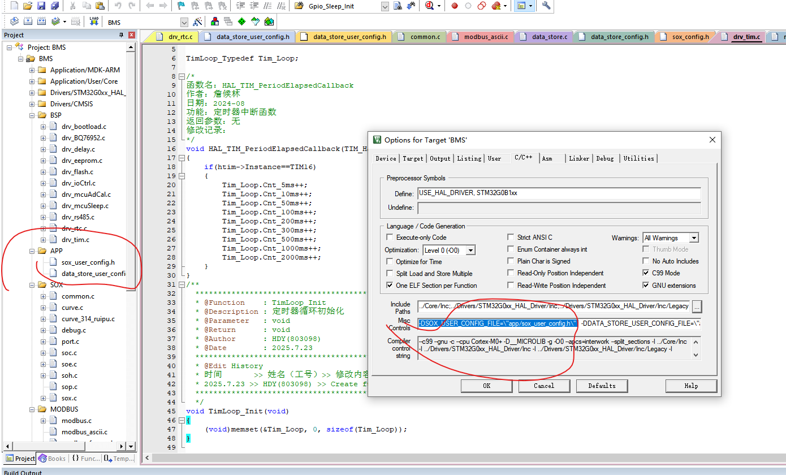

# 移植指南(源方件方式)
## 1. 源文件
```shell
src
├── common.c
├── common.h
├── curve_314_ruipu.c
├── curve.c
├── curve.h
├── debug.c
├── debug.h
├── makefile
├── port.c
├── port.h
├── soc.c
├── soc.h
├── soe.c
├── soe.h
├── soh.c
├── soh.h
├── sop.c
├── sop.h
├── sox.c
├── sox_config.h
├── sox.h
├── sox_private.h
└── sox_user_config.h

```
将本仓库的 `src` 文件下的源文件加入你的工程

## 2. 配置
在你的项目中定义宏 SOX_USER_CONFIG_FILE 指向你的配置文件, 文件内容可以参考 `sox_user_config.h`,
如: 把`sox_user_config.h`复制一份到应用层, 在keil的工程设制中定义宏 `SOX_USER_CONFIG_FILE` 指向你的配置文件, 

或者 你可以直接使用`sox_user_config.h`(不推荐)


关键配置
```c
#define CELL_NUMS                       // 电芯数量
#define CFG_SOX_CELL_TYPE               // 电芯类型 1:eve 100AH 2:ruipu 314AH   
#define PORT_TYPE                       // 移植类型 1:linux 2:mcu             
#define FULL_STD_CLIB                   // 是否有全功能标准库
#define PORT_ARM_AC_6                   // 1:AC 6 or 0:AC 5, 

...
```

## 3. 移植层函数实现
本模块运行需求一些**底层函数**支持, 它们以弱符号的方式存在, 移植时,你需要手动实现它们

它们全部包括在 `port.h` 中

```c
__attribute__((weak))  uint32_t timebase_get_time_s(void);
__attribute__((weak))  int8_t read_saved_soc(float *soc);
__attribute__((weak))  int8_t read_saved_soc_group(uint16_t *grpsoc);
__attribute__((weak))  int8_t write_saved_soc(float *soc);
__attribute__((weak))  int8_t write_saved_soc_group(uint16_t grpsoc);
__attribute__((weak))  int8_t read_saved_soh(float *soh);
__attribute__((weak))  int8_t write_saved_soh(float *soh);
__attribute__((weak))  int8_t read_saved_cycle(uint32_t *cycleTime);
__attribute__((weak))  int8_t write_saved_cycle(uint32_t cycleTime);
__attribute__((weak))  int8_t read_saved_soe(float *totalChgWh, float *totalDsgWh, float *totalChgAh, float *totalDsgAh);
__attribute__((weak))  int8_t write_saved_soe(float totalChgWh, float totalDsgWh, float totalChgAh, float totalDsgAh);
__attribute__((weak))  uint32_t get_cpu_tick(void);
```
以上𠚚数主要包括一个获取时基函数和若干个需要下电保存量的读写函数, 这个需要下电保存的量一般在单片机中保存在eeprom中, 具体的函数参数和返回值说明可以直接查看[port.h](../src/port.h)


## 4. **INIT** and **RUN** the model

### 4.1 call the **init** function
在你的项目合适的地方 `include sox.h`, 在主循环开始前,调用`sox_init()`函数, 此时, 你应该确保你的输入数据已经准备好(电压电流等)

```c
struct SOX_Input{
    float       cur;                       
    uint16_t    vol[CELL_NUMS];
    int16_t     tmp[CELL_NUMS];
    float       grpVol;
    bool        full;
    bool        empty;
};
struct SOX_Init_Attr{
    uint16_t     *chg_stop_vol;               // mv                   pass in by init func, use pointer to sync parameter changed by user(user operation)     
    uint16_t     *dsg_stop_vol;               // mv                   pass in by init func, use pointer to sync parameter changed by user(user operation)   
};

int8_t sox_init(struct SOX_Init_Attr *attr, struct SOX_Input *input);
```
把放空电压与满充电压(通常是项目二级告警参数)包装成 `SOX_Init_Attr`结构体, 传入即可
### 4.2 call the **run** function
在你的项目合适的地方,**周期性**地(通常是1秒)调用`sox_task()`函数
```c

int8_t sox_task(const struct SOX_Input *input);
```
`sox_task`函数需要一个结构体作为输入, 这些输入量包括
* 电流
* 电芯电压
* 电芯温度
* 组压
* 满充满放信号
注意这些变量的类型

## 5.get the **OUTPUT**
在你的项目中需要sox模块输出值的地方,调用结果获取函数
这些函也同样声明在[port.h](../src/sox.h)
```c
float  get_cell_soc(uint16_t cellIndex);
float  get_group_soc(void);
float  get_cell_soh(uint16_t cellIndex);
float  get_group_soh(void);
int8_t get_cell_soc_ary(float *socAry);             // fix len: CELL_NUMS
int8_t get_cell_soh_ary(float *sohAry);             // fix len: CELL_NUMS
float  get_cycle_count(void);
float  get_sig_chg_wh(void);
float  get_sig_dsg_wh(void);
float  get_acc_chg_wh(void);
float  get_acc_dsg_wh(void);
float  get_acc_chg_ah(void);
float  get_acc_dsg_ah(void);
```


-------
*静态库移植方式, 正在编写中...*

